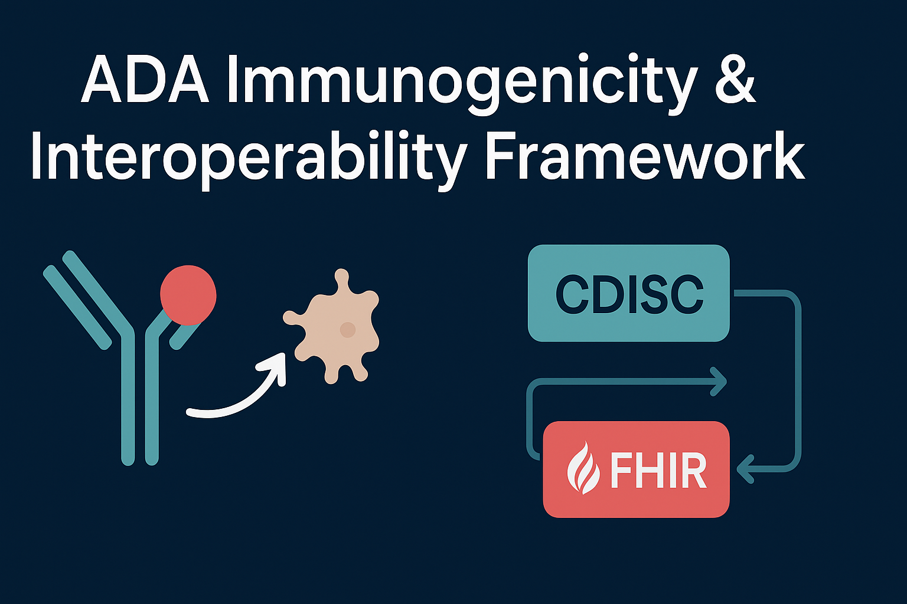

# ADA-Immunogenicity-ClinPharm-CDISC-FHIR-Interoperability-Framework  
*From ADA Assays to Standardized Regulatory Data Exchange*


> **Goal:** Show how immunogenicity (ADA assay results) becomes *regulatory-grade data*
> supporting **PK interpretation**, **ADA risk assessment**, and **submission-ready formats**.



---

## 🔌 Interoperability Pipeline

BioA ADA Measurement → PK/PD Impact → Regulatory-Readable Data
(Standard vs PandA)
│
▼
ADA Standardization & Mapping via this Repo
→ CDISC ADaM-like dataset (ADIMMUN)
→ HL7 FHIR Immunogenicity Observations
→ PASS/ALERT Validation Summary

👇 Example: ADA classification flowing into regulated data artifacts

---

## 📁 Repository Structure

```plaintext
ADA-Immunogenicity-ClinPharm-CDISC-FHIR-Interoperability-Framework/
│
├── README.md
├── config.yml                           # Points to upstream ADA-Panda-Mini reports/
│
├── notebooks/
│   ├── 01_ingest_ada_from_panda_mini.ipynb
│   ├── 02_build_adimmun.ipynb
│   ├── 03_generate_fhir.ipynb
│   └── 04_validations.ipynb
│
├── intermediate/
│   └── ada_harmonized.csv               # Harmonized PK + ADA dataset
│
├── cdisc/
│   └── adam_like/
│       └── adimmun.csv                  # ADaM-like immunogenicity dataset
│
├── interoperability/
│   └── fhir_examples/
│       ├── S001_ADA_Positive.json       # Example FHIR Observation resources
│       ├── S002_ADA_Negative.json
│       └── (one per subject/visit)
│
├── validations/
│   └── summary.md                       # PASS/ALERT + data QC results
```

## ✅ Outputs (Auto-generated)

| Artifact | Format | Location | Purpose |
|---------|--------|----------|--------|
| ADA harmonized dataset | CSV | `intermediate/ada_harmonized.csv` | Standardized raw ADA + PK |
| **CDISC ADaM-like** | CSV | `cdisc/adam_like/adimmun.csv` | Regulatory PK/ADA analysis |
| **FHIR R5 Observations** | JSON | `interoperability/fhir_examples/*.json` | Clinical IT interoperability |
| **Validation Summary** | Markdown | `validations/summary.md` | PASS/ALERT compliance |

---

## 🧬 CDISC ADaM-like Example

```csv
USUBJID, VISIT, METHOD, PARAMCD, ADASTAT, CONC_WK52_NGM
S001, 52, Standard, ADAQUAL, NEG, 250.1
S001, 52, PandA, ADAQUAL, POS, 250.1
S010, 52, Standard, ADAQUAL, NEG, 200.4
S010, 52, PandA, ADAQUAL, NEG, 200.4
```
✅ Distinguishes measured (Standard vs PandA)
✅ PK exposure included
✅ Ready for ER modeling / labeling decisions

## 🌐 FHIR (R5) Example
```json
{
  "resourceType": "Observation",
  "status": "final",
  "code": { "text": "Anti-drug antibody (ADA) assay" },
  "subject": { "reference": "Patient/S001" },
  "effectiveDateTime": "2025-01-01",
  "valueCodeableConcept": { "text": "ADA Positive" },
  "method": {
    "coding": [
      {
        "system": "https://example.org/bioanalytical-methods",
        "code": "PandA",
        "display": "PEG + Acid dissociation"
      }
    ]
  }
}
```
✅ Carries method metadata required for traceability
✅ Ready for EHR immunogenicity dashboards

---

### ✅ What This Enables

| Capability | Supported? |
|-----------|------------|
| Distinguish **Standard vs PandA** measurement | ✅ |
| Include PK exposure in ADA output | ✅ |
| Ready for **Exposure–Response modeling** | ✅ |
| Retain **method traceability metadata** | ✅ |
| Compatible with **EHR SMART-on-FHIR** dashboards | ✅ |

---

## 📌 Why This Matters (Business Case)

✅ Links **bioanalytical performance** → **true immunogenicity risk**  
✅ Supports **dose adjustment & labeling** decisions  
✅ Enables **machine-readable** ADA interpretation  
✅ Aligned with **FDA/EMA immunogenicity guidance** & **CDISC ADaM IG**

> Immunogenicity isn't just a lab result — it drives clinical decision-making.

---

## 🔗 Related Repositories

| Repository | Description |
|-----------|-------------|
| 🔬 **bioanalytical-ADA-drug-interference-to-pandA-correction-method-development** | ADA drug masking + PandA correction simulation |
| 📄 **regulatory-clinpharm-ADA-immunogenicity-reporting-and-bioanalytical-summary** | BAR/ISI-style PK + immunogenicity report |
| 🏛️ **this repo** | CDISC/FHIR regulatory interoperability |

---

## 📚 References

- FDA (2019) — *Immunogenicity Testing of Therapeutic Protein Products*  
- Zoghbi et al., 2015 — PandA improves drug tolerance  
- CDISC ADaM IG — Immunogenicity metadata  
- HL7 FHIR — Observation: immunogenicity profiles  

---

## 🧾 Summary of Utility

✅ Moves ADA from **assay tube → clearance model → regulatory decision**  
✅ Reproducible & transparent  
✅ CDISC & FHIR **interoperability-ready**  
✅ **Recruiter-ready** regulatory data science portfolio 💼  

---

## 🛠️ Run
```bash
git clone https://github.com/camontefusco/ADA-Immunogenicity-ClinPharm-CDISC-FHIR-Interoperability-Framework
cd ADA-Immunogenicity-ClinPharm-CDISC-FHIR-Interoperability-Framework
pip install -r requirements.txt  # if included

# Run notebooks:
01_ingest_ada_from_panda_mini.ipynb
02_build_adimmun.ipynb
03_generate_fhir.ipynb
04_validations.ipynb
```
Update config.yml to point to upstream dataset in:
```bash
"you-repo for ada-panda"/reports/
````
---

## 📬 Contact
Carlos Montefusco
📧 cmontefusco@gmail.com
🔗 GitHub: /camontefusco
